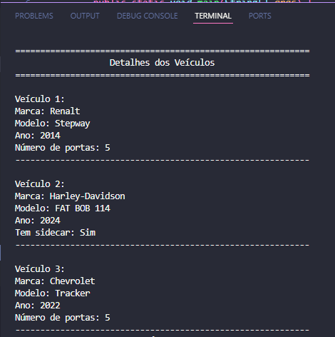
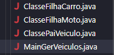

# Sistema de Gerenciamento de Veículos em Java 🚗🏍️

Este projeto foi desenvolvido como parte da disciplina de Programação de Sistemas II durante a minha graduação em Engenharia de Software. O objetivo do projeto é implementar um sistema de gerenciamento de veículos utilizando os conceitos de herança e polimorfismo em Java. Cada veículo é representado como um objeto de classe específica (Carro ou Moto), com atributos e métodos que demonstram a utilização de classes pai e herança.

## 📑 Índice

- [Objetivo do Projeto](#objetivo-do-projeto)
- [Funcionalidades Implementadas](#funcionalidades-implementadas)
- [Estrutura das Classes](#estrutura-das-classes)
- [Telas de Saídas](#telas-de-saídas)
- [Tecnologias Utilizadas](#tecnologias-utilizadas)
- [Como Executar](#como-executar)
- [Conclusão](#conclusao)
- [Autora](#autora)

##  🎯 Objetivo do Projeto

O projeto visa criar um sistema simples para gerenciar veículos, aproveitando conceitos de orientação a objetos, como herança e encapsulamento. O sistema foi projetado para demonstrar a manipulação de uma lista de veículos que inclui carros e motos, sendo possível exibir detalhes específicos de cada tipo.

##  ⚙️ Funcionalidades Implementadas

1. **Listagem de Veículos**: Armazena e exibe veículos de diferentes tipos.
2. **Classes Específicas para Cada Tipo de Veículo**: `Carro` e `Moto`, que estendem a classe `Veiculo`.
3. **Uso de Polimorfismo**: Métodos comuns são sobrescritos para cada tipo de veículo, demonstrando a reutilização e personalização de métodos.
4. **Informações Específicas**: Exibe detalhes específicos de cada veículo (ex.: número de portas para carros e sidecar para motos).
5. **Organização Visual**: Exibição organizada dos detalhes dos veículos no console.

##  🎨 Estrutura das Classes

- **ClassePaiVeiculo.java**: Classe base que representa atributos comuns a todos os veículos, como marca, modelo e ano de fabricação.
- **ClasseFilhaCarro.java**: Classe filha que estende `Veiculo`, adicionando o atributo específico `numeroDePortas`.
- **ClasseFilhaMoto.java**: Classe filha que estende `Veiculo`, incluindo o atributo `temSidecar`.
- **MainGerVeiculos.java**: Classe principal que instancia objetos das subclasses e demonstra o funcionamento do sistema.

##  🖥️ Telas de Saídas

Aqui está uma captura de tela das saídas esperadas na execução do Main e estrutura do projeto

1. **Saída de Dados | Main**

  

2. **Estrutura Projeto**

  

##  🛠️ Tecnologias Utilizadas 

- **Java**: Linguagem de programação utilizada para o desenvolvimento do projeto.
- **VS Code**: IDE utilizada para compilar e executar o código.
- **Estruturas de Dados**: Utilização da `ArrayList` para armazenar objetos de veículos.

##  🚀 Como Executar 

1. Abra a IDE **VS Code** ou outra compatível com Java.
2. Insira cada classe em um arquivo separado para evitar erros de compilação.
3. Execute a classe principal `MainGerVeiculos.java`.

##  📊 Conclusão

Este projeto permitiu consolidar o entendimento sobre herança e polimorfismo, além de reforçar a importância de uma boa estruturação e organização do código. A divisão das classes e a utilização de polimorfismo garantem a reutilização e manutenção do código, aspectos essenciais para o desenvolvimento de sistemas escaláveis.

##  👩‍💻 Autora 

Este projeto foi desenvolvido por **Bárbara Rocha**, estudante de Engenharia de Software na Unicesumar, como parte da disciplina de Programação de Sistemas II. O objetivo foi aplicar e aprofundar os conhecimentos sobre herança em Java, um conceito essencial da programação orientada a objetos.
